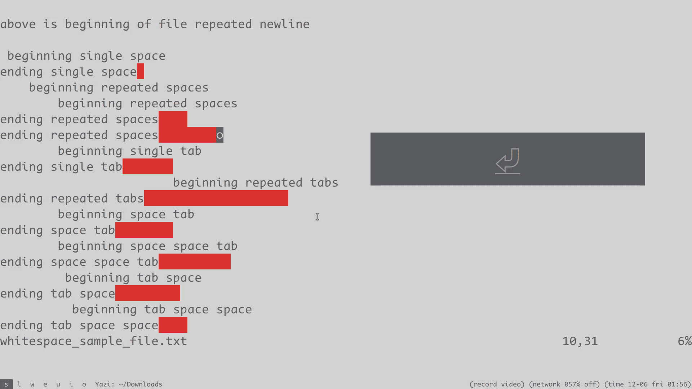

whitespace.nvim - highlight whitespace on demand

# demo



# setup

## setup example 1:

```
require("whitespace").setup()
```

this uses default settings, which is equivalent to:

```
require("whitespace").setup({
	excluded_filetypes = {
	},
	excluded_buftypes = {
	},
	definition = {
		{
			id = "trail",
			pattern = [[\s\+$]],
			pattern_insert = [[\s\+\%#\@<!$]],
			default_display = true,
		},
	},
})
vim.api.nvim_set_hl(0, 'trail', {ctermbg = 1, bg = '#ff0000'})
```

this highlights trailing whitespaces, but it won't highlight them if the cursor is placed at the end in insert mode

`\s\+$` and `\s\+\%#\@<!$` are both vim patterns

## setup example 2:

```
require("whitespace").setup({
	excluded_filetypes = {
		"c",
		"lua",
	},
	excluded_buftypes = {
		".+",
	},
})
```

this highlights the whitespace, but only when:

1. the `filetype` is neither `c` nor `lua`
2. the `buftype` does not match lua pattern `.+`, which means the `buftype` must be an empty string

## setup example 3:

```
require("whitespace").setup()

local toggle = function()
	vim.w.trail = not vim.w.trail
	require("whitespace").match_sync()
end
vim.keymap.set({"n", "x", "i"}, "<f11>", toggle)
```

this defines a function named `toggle`, which toggles the display of trailing whitespaces

## setup example 4:

```
require("whitespace").setup({
	excluded_filetypes = {
	},
	excluded_buftypes = {
		".+",
	},
	definition = {
		{
			id = "trail",
			pattern = [[\s\+$]],
			pattern_insert = [[\s\+\%#\@<!$]],
			default_display = true,
		},
		{
			id = "midmultispacetab",
			pattern = [[\S\zs\s\{2,}\ze\S]],
			default_display = true,
		},
		{
			id = "space",
			pattern = [[ ]],
			default_display = false,
		},
		{
			id = "tab",
			pattern = [[\t]],
			default_display = false,
		},
	},
})

vim.api.nvim_set_hl(0, "trail",            {bg = "#0000ff"})
vim.api.nvim_set_hl(0, "midmultispacetab", {bg = "#ff0000"})
vim.api.nvim_set_hl(0, "space",            {bg = "#0000ff"})
vim.api.nvim_set_hl(0, "tab",              {bg = "#ffff00"})

local toggle = function()
	vim.w.space = not vim.w.space
	vim.w.tab = not vim.w.tab
	require("whitespace").match_sync()
end
vim.keymap.set({"n", "x", "i"}, "<f11>", toggle)
```

you might be able to guess what this setup does

## setup example 5:

if you are using `lazy.nvim`:

```
{
	"aidancz/whitespace.nvim",
	lazy = false,
	config = function()
		require("whitespace").setup()
	end,
}
```

# test

you may use this sample file to test:

http://xahlee.info/emacs/emacs/emacs_init_whitespace_mode.html

```


above is beginning of file repeated newline

 beginning single space
ending single space 
    beginning repeated spaces
        beginning repeated spaces
ending repeated spaces    
ending repeated spaces        
	beginning single tab
ending single tab	
			beginning repeated tabs
ending repeated tabs			
 	beginning space tab
ending space tab 	
  	beginning space space tab
ending space space tab  	
	 beginning tab space
ending tab space	 
	  beginning tab space space
ending tab space space	  

123456789 123456789 123456789 123456789 123456789 123456789 123456789 123456789 
this is a long line. what's “long” is determined by fill-column, not by window width.


 long long long long long long long long long long

LongLineNoWhiteSpacettttttttttttttttttttttttttttttttttttttttttttttttttttttttttttttttttttttttttttttttttttttttt

                  this is a long line with beginning and ending repeated spaces long long long long                


following is end of file repeated newline


```
